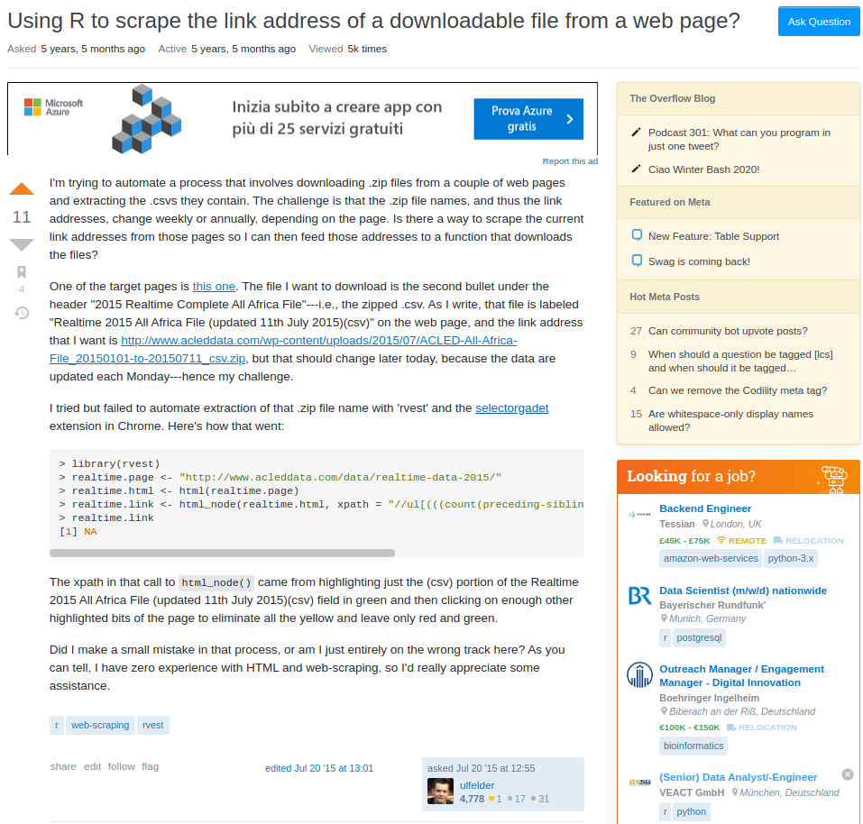
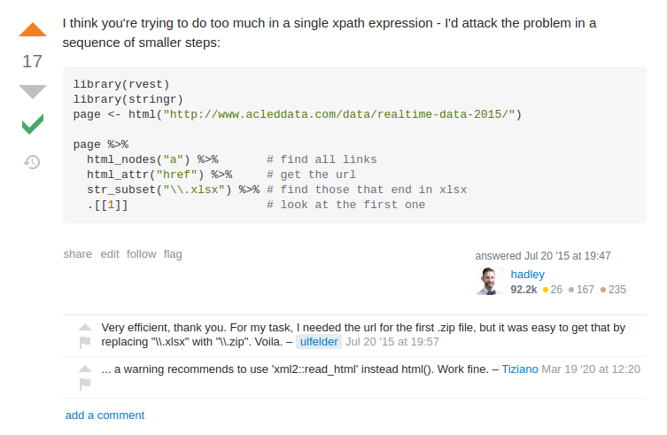

```{r setup, include=FALSE}
knitr::opts_chunk$set(echo = TRUE)
```

## Motivation {-}

I won't lie to you. The very first time I downloaded elections data from the [Tribunal Superior Eleitoral TSE](https://www.tse.jus.br/eleicoes/eleicoes-2018/votacao-e-resultados/boltim_urna_2_turno) was manually ... and painful. 

28 files to download and unzip ... MANUALLY!

But it was also clear to me that this procedure wasn't the most recommended. I should figure out a better way to do that.

Thus, looking for a simple way to solve this problem I found this question on [stackoverflow](https://stackoverflow.com/questions/31517121/using-r-to-scrape-the-link-address-of-a-downloadable-file-from-a-web-page):

```{r stackoverflow, echo=FALSE, out.width="80%", fig.align="center", fig.show='hold'}

```

And Hadley answered it with class.

```{r stackoverflow_answer, echo=FALSE, out.width="80%", fig.align="center", fig.show='hold'}



```

With this valuable info, I needed to:

1. Find the downloadable link as per the question;
2. Apply&Adapt Hadley's solution using _rvest_ package.

# View page source

In order to find the downloadable link, see the gif below or check this [youtube video](https://www.youtube.com/watch?v=TcWhMbY9d88&feature=youtu.be) as the resolution is higher. The tip is to look for the downloadable link right clicking on the _View page source_ button.


```{r gif1, echo=FALSE, out.width="140%", fig.align="center", fig.show='hold'}
knitr::include_graphics("https://media.giphy.com/media/AT01UNuTbZs8UCVP4j/giphy.gif")
```

# R code

The R packages used are:

```{r packages, include=TRUE}

library(rvest)
library(purrr)
library(tibble)
library(data.table)
library(stringr)

```


## Web scraping
The R code below is pretty much what Hadley had posted. I have just adapted it to my problem. Then the object _page_ receives the html file we saw in the video above. The function *read_html()* from package _xml2_ just reads the html. After that we apply *html_nodes()* to find the links, *html_attr()* to get the url and *str_subset()* to find the files ending in .zip and excluding the ones ending in .sha.

```{r webscraping, include=TRUE}

page <- xml2::read_html("https://www.tse.jus.br/hotsites/pesquisas-eleitorais/resultados_anos/boletim_urna/2018/boletim_urna_2_turno.html")

zip_files <- page %>%
  html_nodes("a") %>%       # find all links
  html_attr("href") %>%     # get the url
  str_subset("\\.zip") %>% # find those that end in .zip
  str_subset("\\.sha", negate = TRUE) # rid of the ones ending in .sha


```

Once you have run this code above, you download those files, unzip and save them in your machine.

```{r download_unzip, include=TRUE, eval=FALSE}

for(i in seq_along(zip_files)) {
  
  temp <- tempfile()
  download.file(zip_files[i], temp)
  unzip(temp, exdir = "data/elections_2018")
  unlink(temp)
  
}

```


## Read in data

As we are lazy (or should I say smart enough), let's list all data at once with the function `list.files()`.

```{r list_files, include=TRUE}

csvs_to_read = list.files(
  path = "data/elections_2018",  
  pattern = ".*(bweb_2t).*csv$", 
  recursive = TRUE,          
  full.names = TRUE         
)
```

That done, you can use the fantastic R function *map_df()* from _purrr_ coupled with *fread()* from _data.table_. 

```{r read_csvs, include=TRUE}

elections_2nd_round <- 
  csvs_to_read %>% 
  map_df(~fread(., colClasses = 'character', showProgress = TRUE)) %>% 
  as_tibble()

```

In a few seconds you get your data (nearly 3 million rows and 1,3GB) ready to be analysed.

# Conclusion

That's all folks. Pretty simple to web scraping Brazil's Presidential Election data.