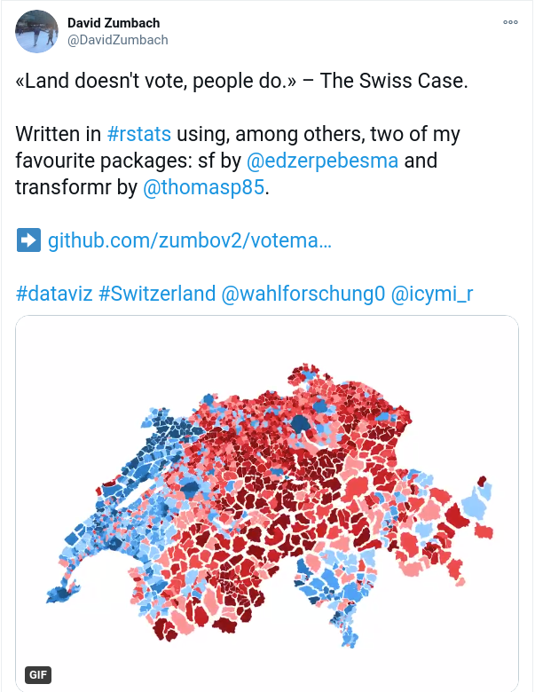
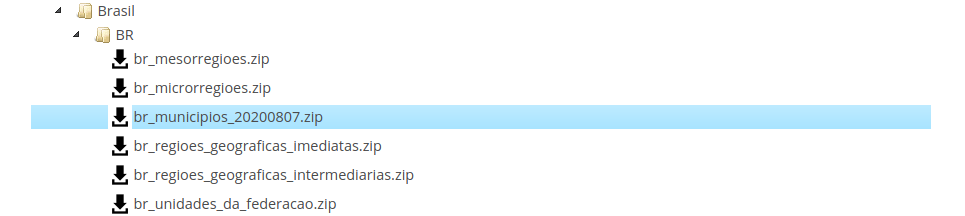
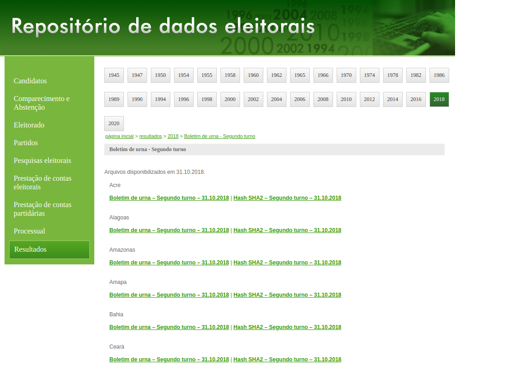

```{r setup, include=FALSE}
knitr::opts_chunk$set(echo = TRUE)
```

# Motivation {-}

You may think this post was written too late as we're already in 2021 and we are working on the 2018 Brazil's presidential election data. Nevertheless, it's never late to do nice data visualizations, and I got inspiration to write this post after seeing an outstanding map made by [David Zumbach](https://twitter.com/DavidZumbach). He made the code available on this [Github repository](https://github.com/zumbov2/votemapswitzerland) and I will apply roughly the same idea (mine is a bit simpler) in the Brazilian election.

```{r tweet, echo=FALSE, out.width="60%", fig.align="center", fig.show='hold'}

```

# Presidential Elections

The presidential election takes place every four years in Brazil. The last one occurred in 2018 and ended up with a winning of the candidate Bolsonaro.

```{r gif1, echo=FALSE, out.width="40%", fig.align="center", fig.show='hold'}
knitr::include_graphics("https://media.giphy.com/media/l49JXgRo7W0vyg8h2/giphy.gif")
```

However, I am not here to talk about how Bolsonaro is (mis)leading Brazil. I am interested in visualizing the share of votes he got in the second round of the election. For more information regarding the Brazilian elections, please go visit the [Tribunal Superior Eleitoral (TSE)](https://www.tse.jus.br/eleicoes/processo-eleitoral-brasileiro/funcionamento-do-processo-eleitoral-no-brasil) webpage.

# Data

In order to produce a map with the proportion of votes Bolsonaro got, we will need to pull:

- the shape files at municipalities level from **IBGE** (Instituto Brasileiro de Geografia e Estatística);
- the results of the elections from **TSE**;
- mapping table with municipalities codes IBGE - TSE.

## Shape files

The shape files can be downloaded from [here](https://www.ibge.gov.br/geociencias/organizacao-do-territorio/15774-malhas.html?=&t=o-que-e). Then you select **Downloads $\Rightarrow$  municipio_2019 $\Rightarrow$  Brasil $\Rightarrow$  BR $\Rightarrow$  br_municipios zip file**.

```{r ibge_image, echo=FALSE, out.width="90%", fig.align="center", fig.show='hold'}

```

## Election results

The outcome of the elections are available [here](https://www.tse.jus.br/eleicoes/eleicoes-2018/votacao-e-resultados/boltim_urna_2_turno). The data is divided by state, so you will need to download 28 zip files (26 states + Distrito Federal + Votes from Abroad). Instead, if you want to go for a smart solution, please have a look at this [post](https://www.brunovidigal.com/posts/2021-01-09-web-scraping-brazils-presidential-election-data/) that I have written. I will walk you on how to download these data automatically from R.

```{r tse_image, echo=FALSE, out.width="100%", fig.align="center", fig.show='hold'}

```

## Mapping table IBGE - TSE

This table is quite useful as it contains the mapping of municipalities codes from IBGE to TSE. It is stored on this [Github](https://github.com/kelvins/Municipios-Brasileiros) repository.

# Reading Input Data

```{r packages, include=FALSE}

library(tidyverse)
library(data.table)
library(sf)
library(scales)

```

Let's start by reading the mapping table from the Github repository.

```{r mapping, include=TRUE}

download.file(url = 'https://raw.githubusercontent.com/betafcc/Municipios-Brasileiros-TSE/master/municipios_brasileiros_tse.csv', 
              destfile = 'data/mapping_tse_ibge.csv')

mapping_tse_ibge <- read_csv('data/mapping_tse_ibge.csv')
mapping_tse_ibge <- mapping_tse_ibge %>% 
  select(codigo_tse, codigo_ibge) %>% 
  mutate(codigo_tse = as.character(str_pad(codigo_tse, 5, pad = '0')),
         codigo_ibge = as.character(codigo_ibge))

mapping_tse_ibge
```

The **shape file** from IBGE is below. 

```{r shapefile, include=TRUE}

br_shp <- st_read("data/br_municipios_20200807/BR_Municipios_2019.shp")
class(br_shp)

```

If we plot the shape file above we get:

```{r first_map, include=TRUE, fig.width=20,fig.height=15}

br_shp %>% 
  ggplot() + 
  geom_sf() +
  theme_void() +
  ggtitle('Brazil - Municipalities')

```

The last piece of info needed are the votes. As we saw in my previous [post](https://www.brunovidigal.com/posts/2021-01-09-web-scraping-brazils-presidential-election-data/), the results of the elections are split by state (`SG_UF`), and within each file/state, the data are disaggregated by municipality (`NM_MUNICIPIO`) and electoral section (`NR_SECAO`). 
Let's first get the name of all csv's files we need to read. Instead of typing one by one ...

```{r gif2, echo=FALSE, out.width="40%", fig.align="center", fig.show='hold'}
knitr::include_graphics("https://media.giphy.com/media/gf58YQbHE6lX6vItke/giphy.gif")
```

We can use the function _list.files()_.


```{r list_files, include=TRUE}

csvs_to_read = list.files(
  path = "data/elections_2018",  
  pattern = ".*(bweb_2t).*csv$", 
  recursive = TRUE,          
  full.names = TRUE         
)

head(csvs_to_read)

```

Now we're ready to go ahead and read all those files. Another amazing function that we're going to use is _map_df()_ from `purrr`. Here I am using also _fread()_ from package `data.table`. Combining both **tidyverse** and **data.table** solutions minimize as much as possible the time to read and combine the files into one single object of class tbl_df. 

```{r read_csvs, include=TRUE}

elections_2nd_round <- 
  csvs_to_read %>% 
  map_df(~fread(., colClasses = 'character', showProgress = TRUE)) %>% 
  as_tibble()

```

The final object has `r nrow(elections_2nd_round)` rows and `r ncol(elections_2nd_round)` columns.

Let's see how our data looks like. As I am biased I will filter my hometown [Rio Pomba](https://pt.wikipedia.org/wiki/Rio_Pomba_(Minas_Gerais)). My city has about 18,000 habitants and is located in the countryside of the state of Minas Gerais. We're famous about our cheese and doce de leite (milk jam or dulce de leche in Spanish). But here we go, we select Rio Pomba and a random electoral section. Mind that the data found contain not only the number of votes for each candidate, but also the number of null and blank. In this analysis, we're interested in analysing only the valid votes.

```{r rio_pomba, include=TRUE}

str(elections_2nd_round %>% 
  filter(NM_MUNICIPIO == 'RIO POMBA' & NR_SECAO == 20))

```

As you may be thinking, we need to:

- aggregate the data at municipality level;
- filter only valid votes for president;
- calculate Bolsonaro's share (% of votes for Bolsonaro);
- get the municipality code at IBGE code by merging with the mapping table.

The piece of code below does this for us.

```{r aggregate_votes, include=TRUE}

votes_by_city <- elections_2nd_round %>% 
  filter(!is.na(as.numeric(QT_VOTOS))) %>% 
  group_by(NM_MUNICIPIO, CD_MUNICIPIO, `SG_ UF`, NM_VOTAVEL, DS_CARGO_PERGUNTA) %>% 
  summarise(votes_total = sum(as.numeric(QT_VOTOS))) %>% 
  filter(DS_CARGO_PERGUNTA == 'Presidente' & `SG_ UF` != 'ZZ') %>% ## ZZ means votes abroad 
  spread(NM_VOTAVEL, votes_total) %>% 
  mutate(valid_votes = `FERNANDO HADDAD` + `JAIR BOLSONARO`,
         perc_bolsonaro = `JAIR BOLSONARO`/valid_votes) %>% 
  left_join(mapping_tse_ibge, by = c("CD_MUNICIPIO" = "codigo_tse")) %>% 
  ungroup() %>% 
  select(codigo_ibge, valid_votes, perc_bolsonaro)

votes_by_city
```

Categorizing our variable ...

```{r cat_perc_votes, include=TRUE}

# Recoding Bolsonaro's votes
votes_by_city <- votes_by_city %>% 
  mutate(
    perc_bolsonaro_cat = factor(case_when(
      perc_bolsonaro < 0.35 ~ "",
      perc_bolsonaro >= 0.35 & perc_bolsonaro < 0.40 ~ "35", 
      perc_bolsonaro >= 0.40 & perc_bolsonaro < 0.45 ~ "40",
      perc_bolsonaro >= 0.45 & perc_bolsonaro < 0.50 ~ "45",
      perc_bolsonaro >= 0.50 & perc_bolsonaro < 0.55 ~ "50",
      perc_bolsonaro >= 0.55 & perc_bolsonaro < 0.60 ~ "55",
      perc_bolsonaro >= 0.60 & perc_bolsonaro < 0.65 ~ "60",
      perc_bolsonaro >= 0.65 ~ "65"
    ), levels = c("", "35", "40", "45", "50", "55", "60", "65")
    )
  )

```

## Data Merging

```{r merge, include=TRUE}
votes_by_city_shp <- br_shp %>% 
  left_join(votes_by_city, by = c("CD_MUN" = "codigo_ibge")) %>% 
  filter(!is.na(valid_votes))

```

## Map

Here we go, the map of votes at municipality level.

```{r map, include=TRUE, fig.width=20,fig.height=15}

ggplot(data = votes_by_city_shp, aes(geometry = geometry)) +
  geom_sf(aes(fill = perc_bolsonaro)) +
  scale_fill_binned(low = "#c91022", high = "#1a7bc5", labels = percent) +
  # scale_fill_viridis_c(option = "plasma", trans = "sqrt", labels = percent) +
  theme_void() +
  labs(title = "Percentage Votes for Bolsonaro",
       subtitle = "2nd round - Presidential Elections 2018",
       caption = "@vidigal_br") +
  theme(legend.title = element_blank()) +
  # theme(legend.key.size = unit(0.2, "cm")) +
  theme(plot.title = element_text(size = 30, face = "bold", family = 'calibri')) +
  theme(plot.subtitle = element_text(size = 20, face = "bold", family = 'calibri')) +
  theme(plot.caption = element_text(size = 15, face = "bold", family = 'calibri'))


```

The map of the categorical variable looks like this ...

```{r map_cat, include=TRUE, fig.width=20,fig.height=15}

ggplot(votes_by_city_shp$geometry) +
  geom_sf(aes(fill = votes_by_city_shp$perc_bolsonaro_cat), color = NA) +
  coord_sf() +
  scale_fill_manual(
    values = c(
      "#8d0613", "#c91022", "#f1434a", "#ff9193",
      "#91cdff", "#42a2f1", "#1a7bc5", "#105182"
    ),
    drop = F,
    guide = guide_legend(
      direction = "horizontal",
      keyheight = unit(2, units = "mm"),
      keywidth = unit(c(25, rep(7, 6), 25), units = "mm"),
      title.position = "top",
      title.hjust = 0.5,
      label.hjust = 1,
      nrow = 1,
      byrow = T,
      reverse = T,
      label.position = "bottom",
    )
  ) +
  theme_void() +
  theme(legend.position = "bottom") +
  theme(plot.title = element_text(size = 30, face = "bold", family = 'calibri')) +
  theme(plot.subtitle = element_text(size = 20, face = "bold", family = 'calibri')) +
  theme(plot.caption = element_text(size = 15, face = "bold", family = 'calibri')) +
  theme(legend.text = element_text(size = 15, face = "bold", family = 'calibri')) +
    labs(title = "Percentage Votes for Bolsonaro",
       subtitle = "2nd round - Presidential Elections 2018",
       caption = "@vidigal_br") +
  theme(legend.title = element_blank())


```

However, as **land doesn't vote ... people do**, we will make another map taking into account the number of valid votes per each municipality. This piece of code comes from **David Zumbach**, I have just adapted to my own data/variables.

```{r radi, include=TRUE}

# Prep function inputs (specify radius factor)
radii <- votes_by_city_shp %>% 
  # filter(mun_id %in% start$id) %>% 
  select(CD_MUN, valid_votes) %>% 
  mutate(radius = sqrt(3000*valid_votes / pi)) %>% 
  arrange(CD_MUN) %>% 
  pull(radius) 

ids <- votes_by_city_shp$CD_MUN

# Transformation from Polygons to circles

# Function to draw circles 
draw_circle <- function(id, centre_x = 0, centre_y = 0, radius = 1000, detail = 360, st = TRUE) {
  
  i <- seq(0, 2 * pi, length.out = detail + 1)[-detail - 1]
  x <- centre_x + (radius * sin(i))
  y <- centre_y + (radius * cos(i))
  
  if (st) {
    
    cir <- st_polygon(list(cbind(x, y)[c(seq_len(detail), 1), , drop = FALSE]))
    d <- st_sf(data.frame(id = id, geom = st_sfc(cir)))
    
  } else {
    
    d <- tibble(id = id, x = x, y = y)
    
  }
  
  return(d)
  
}

# Draw circles
# centroids <- as_tibble(st_coordinates(st_centroid(mapa_mg)))
centroids <- st_transform(votes_by_city_shp$geometry, 29101) %>% 
  st_centroid() %>% 
  # this is the crs from d, which has no EPSG code:
  # st_transform(., '+proj=longlat +ellps=GRS80 +no_defs') %>%
  # since you want the centroids in a second geometry col:
  st_coordinates() %>% 
  as_tibble()

class(centroids)

perc_bolsonaro <- votes_by_city_shp$perc_bolsonaro

end <- pmap_dfr(list(ids, centroids$X, centroids$Y, radii), draw_circle)

## merge

end_votes <- end %>% 
  left_join(votes_by_city, by = c("id" = "codigo_ibge")) 

```

Now we're ready to plot the map with circles weighted by the number of valid votes. Big cities like São Paulo and Rio de Janeiro will be better represented.

```{r map_circles, include=TRUE, fig.width=25,fig.height=18}

ggplot(end_votes) +
  geom_sf(aes(fill = perc_bolsonaro_cat), color = NA) +
  coord_sf() +
  scale_fill_manual(
    values = c(
      "#8d0613", "#c91022", "#f1434a", "#ff9193",
      "#91cdff", "#42a2f1", "#1a7bc5", "#105182"
    ),
    drop = F,
    guide = guide_legend(
      direction = "horizontal",
      keyheight = unit(2, units = "mm"),
      keywidth = unit(c(25, rep(7, 6), 25), units = "mm"),
      title.position = "top",
      title.hjust = 0.5,
      label.hjust = 1,
      nrow = 1,
      byrow = T,
      reverse = T,
      label.position = "bottom",
    )
  ) +
  theme_void() +
  theme(legend.position = "bottom") +
    labs(title = "Percentage Votes for Bolsonaro",
       subtitle = "2nd round - Presidential Elections 2018",
       caption = "@vidigal_br") +
  theme(legend.title = element_blank()) +
  theme(plot.title = element_text(size = 30, face = "bold", family = 'calibri')) +
  theme(plot.subtitle = element_text(size = 20, face = "bold", family = 'calibri')) +
  theme(plot.caption = element_text(size = 15, face = "bold", family = 'calibri')) +
  theme(legend.text = element_text(size = 15, face = "bold", family = 'calibri')) 

  
```